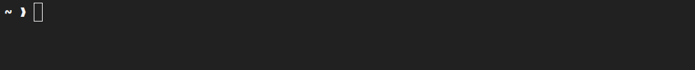

# fancy_hello_word

That fancy instagram reel animation for printing hello world, but written in
rust


## Installation

To install this program... if you really want to... use the following command.

```
cargo install --git https://github.com/danielronalds/fancy_hello_word.git
```

## CLI Options

#### Changing the time delay
Using the `--time` flag you can change the time between prints by providing a
new time in milliseconds. You can also use the shorthand `-t` flag

#### Changing the string to print
Using the `--string` flag you can also change the string to be fancy printed.
You can also use the shorthand `-s` flag

#### Printing on the same line
You can get the animation to print all on the same line using the `--one-line`
flag. This will append a '\r' character to the end of the line instead of the
'\n' character. You can also use the shorthand `-o` flag

